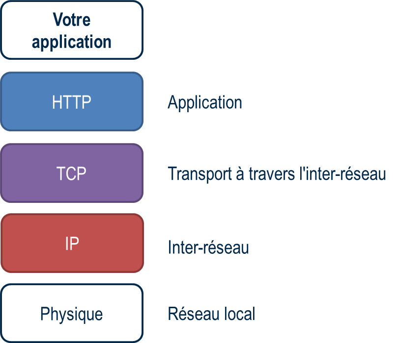
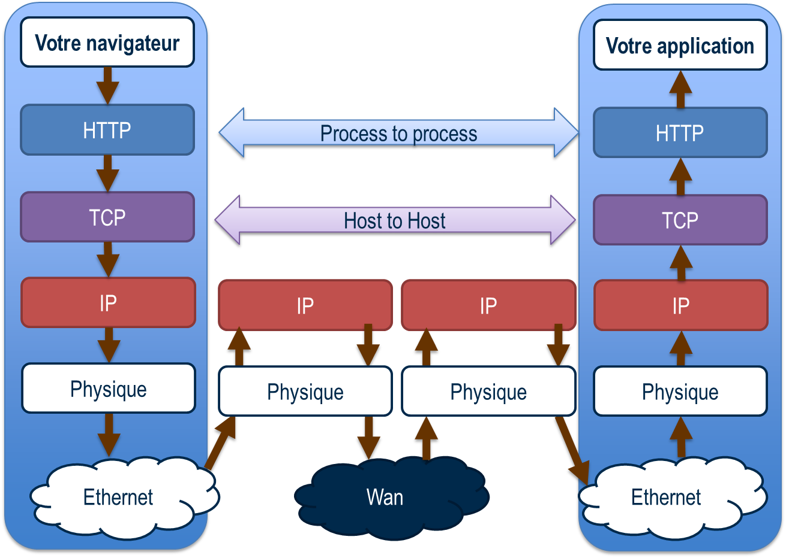
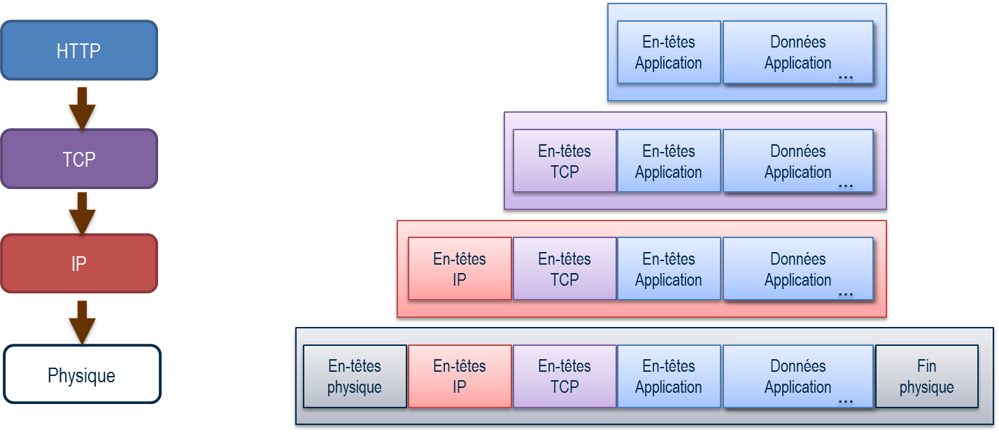
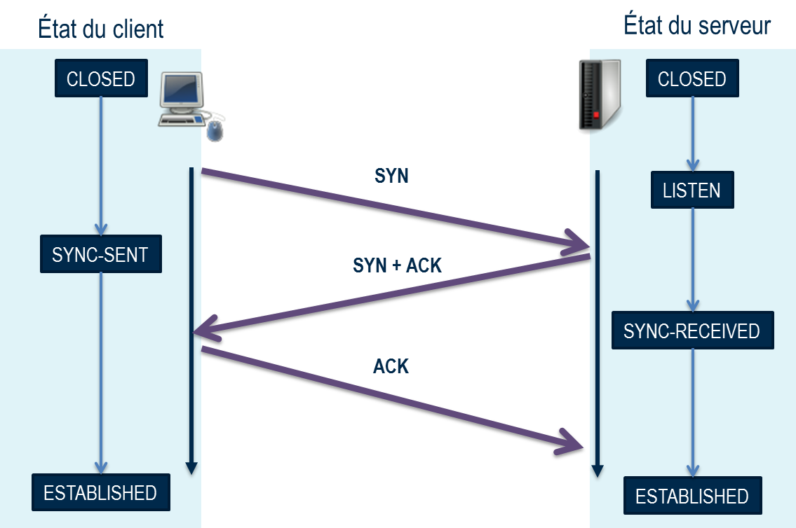
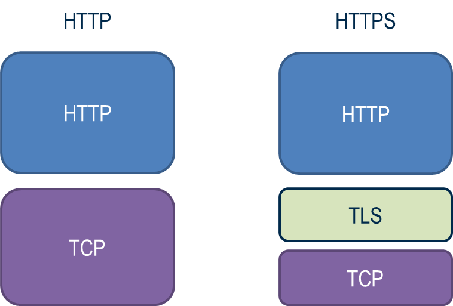
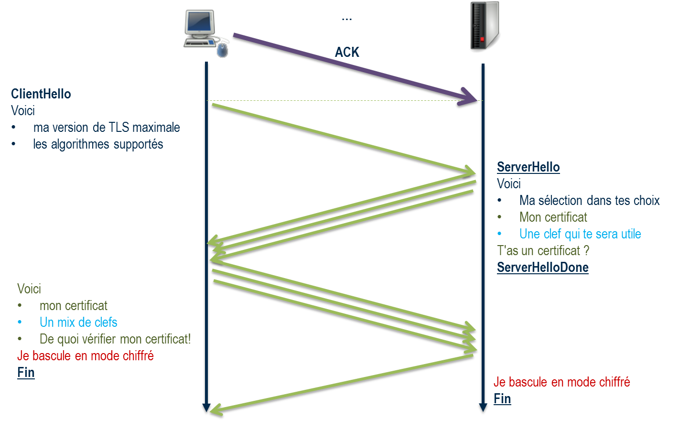

HTTP
----

Le propre d'une application web est d'utiliser le protocole HTTP. De nombreuses failles reposent sur une mauvaise compréhension de ce protocole, aussi tout développeur souhaitant dépasser le state de débutant confirmé footnote:[au sens du modèle de compétence de Dreyfuss & Dreyfuss] se doit de le comprendre.

Histoire courte
~~~~~~~~~~~~~~~

HTTP signifie **H**yper **T**ext **T**ransport **P**rotocole

Histoire longue en 2 secondes (à détailler)

* 1989 : Création par Tim Berners-Lee au CERN,
* 1996 : HTTP/1.0, décrit dans la RFC 1945
* 1997 : HTTP/1.1, normalisé par l'IETF RFC 2616
* 2014 : éclatement plusieurs RFC
* 2012: groupe de travail sur HTTP/2.0

Pile protocolaire
~~~~~~~~~~~~~~~~~ 

HTTP est un protocolaire de haut niveau. Selon le modèle OSI footnote:[cf. https://fr.wikipedia.org/wiki/Mod%C3%A8le_OSI], on peut le situer sur la couche n°7 _Application_.

Cela signifie que HTTP repose sur des couches réseaux footnote:[Pour faire grossier, ces couches successives ont pour responsabilité de transformer les échanges entre un navigateur et un serveur en signaux électriques ou en ondes radio qui passent par le réseau filaire ou wifi. Pour plus d'information]

.Pile protocolaire

La couche ((IP)) (Internet Protocol) est un ensemble de protocoles réseau en charge de faire en sorte que des réseaux physiques différents (LAN et WAN) puissent communiquer.
IP ne garantit en rien que les données arrivent dans l'ordre ou même qu'elles arrivent toutes à destination. Les paquets sont transmis en mode _Best Effort_ footnote:[Best Effort c'est à dire qu mieux des capacités mais sans engagement de résultat]. C'est le travail de la couche au dessus, TCP.

La couche ((TCP)) (Transmission Control Protocol) est un protocole de transport qui est responsable de la garantie de leur arrivé et de leur ordonnancement. TCP est dit _connecté_ dans le sens où il se préoccupe de la connexion des deux parties souhaitant échanger des données.

.Echange TCP de bout en bout à travers les couches

On a coutume de dire que la couche TCP est en charge du dialogue entre serveurs et http du dialogue entre processus.

[NOTE]
.Transmission des données entre couches réseau
====
Comment les données passent-elles à travers les couches ?

Chaque couche de niveau _n_ fournit une structure de données à la couche inférieur _n-1_, laquelle _encapsule_ 
la structure de donnée de niveau _n_ dans une structure de niveau _n-1_ et ainsi de suite.

Il y a des opérations intermédaires, notamment le découpage de paquets de niveau _n_ en petits paquets de niveau _n-1_

====

Chaque processus est identifiable par 

* une adresse https://fr.wikipedia.org/wiki/Adresse_IP[IP]
* un port 

Une connexion TCP/IP est basée sur deux couples 

* (adresse IP, port) du client
* (adresse IP, port) du serveur

Sur les deux composants, client et serveur, la communication TCP/IP se fait à travers de `socket`. Un ((socket)) est une interface entre l'extérieur et l'intérieur de chacun.

[NOTE]
====
Il existe deux versions d'adresses IP actuellement utilisées

* IP v4 sur 32 bits, soit 4 octets, 
* https://fr.wikipedia.org/wiki/IPv6[IP v6] sur 128 bits, soit 16 octets.

L'adresse IP v4 s'écrit sous la forme xxx.xxx.xxx.xxx où un block xxx est un entier compris entre 0 et 255

L'adresse IP v6 s'écrit sous la forme de 8 groupes de 2 octets *en hexadécimale* séparés par un symbole _deux-points_ `:`

 2001:0db8:0000:85a3:0000:0000:ac1f:8001

Plusieurs règles permettent de simplifier cette adresse: en résumant les blocs de zéro à un seul zéro

 2001:0db8:0000:85a3:0000:0000:ac1f:8001
           ----      ---- ----
 2001:0db8:0:85a3:0:0:ac1f:8001
           ^      ^ ^ 
 
ou en utilisant le symbole _double deux-points_ `::` quand deux blocs de zéro se succèdent

 2001:0db8:0:85a3:0:0:ac1f:8001
                  ^ ^ 
 2001:0db8:0:85a3::ac1f:8001
                 ^^  
====

Le protocole utilisé pour l'ouverture d'une connexion TCP/IP est appelé _Three-Way Handshake_

.TCP three way handshake

Par état du client ou du serveur nous parlons de leurs états de connexion.

* le serveur est état d'écoute (_LISTEN_)
* Dans un premier temps le client envoie une trame TCP avec le flag `SYN` au serveur. C'est une demande de synchronisation. Après envoi, il se met dans l'état `SYN-SENT`
* le serveur prend en compte la demande et répond par un `SYN-ACK`, pour signifier l'acceptation de la demande initial. Le seveur passe en état `SYNC-RECEVEID` 
* le client valide la réponse du serveur par l'envoi d'une trame `ACK` et considère la connexion établie `ESTABLISEHD`.
* A la réception de la trame `ACK`, le serveur considère la connexion établie lui aussi.

Les échanges peuvent alors commencer.

TLS
~~~ 

HTTP transporte les données en clair par défaut. Cela veut dire que le trafic est entièrement visible pour tout acteur ou composant entre le client et le serveur. Or dans le monde l'internet, le chemin pris n'est pas déterminable et il convient de s'assurer que les données applicatives ne soient pas accessibles.

Pour cela, il est nécessaire de chiffrer la communication.

Le choix historique est d'insérer entre HTTP et TCP/IP une couche en charge de chiffrer le trafic. Cette couche s'appelle TLS pour _Transport Layer Security_.

.Positionnement de TLS

Si nous reprenons l'ouverture d'une connexion TCP/Ip précédente, nous pouvons y ajouter l'établissement, _une fois la connexion TCP établie_, de la session TLS.

.Handshake TLS

* Après l'envoi du `ACK` final du dialogue TCP, la couche TLS commence le sien en vue d'établir une session
* Le client initie le dialoge TLS en envoyant une commande `clientHello`. Cette commande contient des informations sur 
** la version maximale de TLS supportée par le client,
** la liste des algorithmes de chiffrement (cipher) supportés par le client.
* Le serveur répond à son tour par un `serverHello` avec une sélection parmi les choix proposés par le client quant à la version de TLS et l'algorithme de chiffrement à utiliser.
* Puis le serveur envoie des éléments d'identification
** son certificat pour que le client puisse établir la preuve de son identité
** une clef qui va servir à établir la clef de chiffrage symétrique
* Le serveur peut demander également au client de fournir un certificat pour établir lui aussi son identité.
* Le client va répondre en créant une clef à partir de celle fournie par le serveur et l'algorithme sélectionné
** il peut renvoyer son certificat pour identification
* le client bascule en mode chiffré
* le serveur bascule en mode chiffré

Pour plus de détail, consulter les références

.Références
****
* https://fr.wikipedia.org/wiki/Transmission_Control_Protocol[TCP (Wikipédia)]
* https://fr.wikipedia.org/wiki/Internet_Protocol[Internet Protocol (Wikipédia)]
* https://fr.wikipedia.org/wiki/Cipher[Cipher ou Chiffrement (Wikipédia]
* https://fr.wikipedia.org/wiki/Socket[Socket]
* http://robertheaton.com/2014/03/27/how-does-https-actually-work/[How does HTTPS actually work?]
* http://wiki.linuxwall.info/doku.php/fr:ressources:dossiers:ssl_pki:1_les_bases#tls_handshake_protocol[TLS handshake (en français)]
* http://www.authsecu.com/ssl-tls/ssl-tls.php[TLS handshake (en français)]

****

Protocole: le P de HTTP
~~~~~~~~~~~~~~~~~~~~~~~ 

Le protocole HTTP consiste en une suite de ((requête))s et de ((réponse))s vis-à-vis d'une ressource.