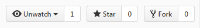

= Contribuer au guide
Author Name
:doctype: article
:encoding: utf-8
:lang: en
:toc: left
:numbered:

Le guide est construit collaborativement sur le principe d'un projet open-source usuel.
Ce document décrit comme y contribuer.

== Préalable

Le guide est en tant que projet open-source est hébergé par github. Il est donc  nécessaire d'y avoir un compte.

Ensuite vous avez deux options : 

* mode développeur
* mode néophyte

Le mode néophyte présuppose l'installation de l'outil https://desktop.github.com/[desktop de github]

Nous supposerons que vous avez installé git en version supérieure à la 1.9

Nous supposerons également que votre compte utilisateur github est `mon-compte-github`

== Fork, modification, pull-request

Derrière ces termes barbares se cachent les opérations de base git

[glossary]
Fork::
	Faire une fourchette :) Faire une copie d'un projet pour pouvoir y travailler.

Pull-request::
	Proposer ses modifications pour validation.

=== Forker le dépôt github

* Se rendre sur le dépôt du livre https://github.com/nmsaw/livre
* Cliquer sur l'icône `Fork`

.Forker

* Cloner votre copie sur votre poste

[source,bash]
----
git clone https://github.com/mon-compte-github/livre.git
----

* Ajouter le dépôt nmsaw comme référence 
 
[source,bash]
----
git remote add upstream https://github.com/nmsaw/livre.git
----
* Vérifier que vous la liste des références distantes suivantes

[source,bash]
----
> git remote -v
origin  https://github.com/mon-compte-githu/livre.git (fetch)
origin  https://github.com/mon-compte-githu/livre.git (push)
upstream        https://github.com/nmsaw/livre.git (fetch)
upstream        https://github.com/nmsaw/livre.git (push)
----

=== Se mettre à jour par rapport à la version de référence

Il est bon de garder votre copie en synchronisation avec le repos du groupe nmsaw

Pour se faire suivre les étapes suivantes

* aller dans votre dépôt local
* demander les évolutions depuis la référence (`fetch` ne modifie pas les fichiers !)

----
> git fetch upstream
remote: Counting objects: 1, done.
remote: Total 1 (delta 0), reused 1 (delta 0), pack-reused 0
Unpacking objects: 100% (1/1), done.
From https://github.com/nmsaw/livre
 * [new branch]      http_temp  -> upstream/http_temp
 * [new branch]      intro      -> upstream/intro
 * [new branch]      master     -> upstream/master
----

* aller sur votre branche `master`

----
git checkout master
----

* fusionner avec les dernières évolutions de `upstream/master` 

----
git merge upstream/master
----

Vous êtes à jour !

==== Créer une pull request

La `pull-request` va permettre de demander l'intégration de vos modifications, *après relecture*, dans le dépôt de référence.

* Aller sur sa page github
* Faire créer une pull-request